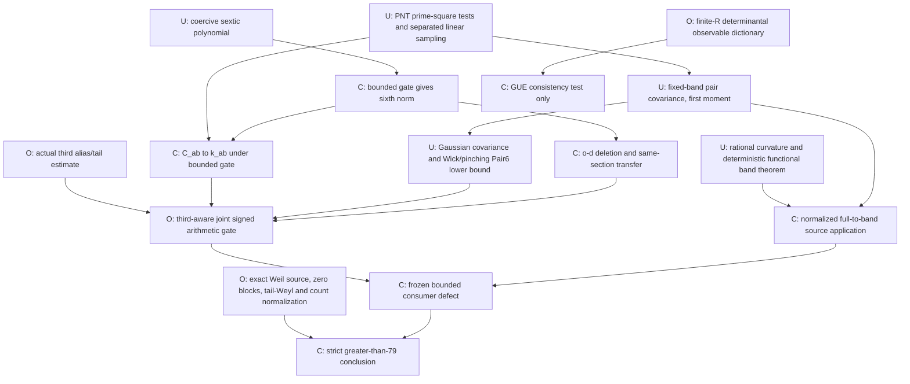

# WP84 independent referee response: foundations and the GUE dictionary gate

2026-10-08. Independent foundation audit. This clean publication copy omits
the source repository's private Git references and historical packet.

**Verdict:** the bounded-gate C_ab replacement, disjoint-cell sampling lemma,
Pair6_6000 lower bound, and rational curvature certificate survive the audit
with their hypotheses stated below. The deterministic functional-band theorem
survives; its application to the normalized zero-side matrix remains a separate
source interface. Centered same-section mu3=o(1) is **not proved by the cited
sources**. The original consumer must keep its third coefficient unless that
input is proved. The finite-R sine/GUE dictionary is **not established**;
Phase B stops before computing any fifth/sixth model observable. Strict >79
remains OPEN.

## 1. Exact scope and source objects

Keep X=T/(2*pi), L=log X, N=floor(exp(L-sqrt L)), h=2*pi/L,
d=floor(TL/(2*pi)), R=6000, I=[a,a+n-1], n/d->1, and
c_m=-Lambda(m)/(a_phi L sqrt m), m=p^v<=N, a_phi->1.
For ordinary primes the actual Hermitian hard-band matrix has

    alpha_i=Im sum_p c_p exp(i*(T+h*i)*log p),
    beta_i=2 Re sum_p c_p*(1-log p/L) exp(i*(T+h*i)*log p),
    Y_ii=beta_i, Y_ij=(alpha_i-alpha_j)/(pi*(j-i)), 0<|j-i|<=R.

Its moments are normalized traces of powers, not scalar cumulants of a zero
counting statistic. Original closed displacement paths and root intervals
are retained; no ordinary-prime pool is shortened. The preceding complete
prime-power/ordinary-prime **bounded-gate equivalence** remains the power
interface, not unconditional disposal of every frequency-masked power term.

## 2. C_ab -> k_ab: exact lemma and complete proof

For paired slots a,b on a fixed closed b-path, b=5 or 6, write

    phi_ab(s)=2 Re[f_(ell_a)^+(s) f_(ell_b)^-(s)
                           exp(2*pi*i*(q_(a-1)-q_(b-1))*s)],
    C_ab(T)=sum_(p<=N) c_p^2 phi_ab(log p/L),
    k_ab=integral_0^1 s*phi_ab(s) ds.

All Fourier indices satisfy |ell|<=6000. The prime-square PNT discrepancy
in WP84_PNT_PRIME_SQUARE_MEASURE_UPGRADE gives, for each of these finitely
many fixed bounded-variation tests,

    |C_ab(T)-k_ab|<=delta_R(T),
    delta_R(T)=O_R(L^-1/2+|a_phi^-2-1|+L^-2)->0.    (1)

The L^-1/2 term pays the natural cutoff endpoint 1-1/sqrt L. The actual
source prime normalization is explicit; without a_phi->1 this limit changes.

**Lemma.** Replacement in the complete orientation-summed fifth/sixth gate
costs o(1) if J(Y)=tau_n(BY^6-AY^5) is bounded above, A=11501/12500,
B=137641/250000. It also holds when the corresponding reduced gate is
bounded above, via the noncircular bootstrap below.

Proof. Pointwise

    Bx^6-Ax^5 >= (B/2)|x|^6-C,
    C=(A/6)*(5A/(3B))^5.

For nonnegative x set z=x/(5A/(3B)); the residual is C times
(z-1)^2(5z^4+4z^3+3z^2+2z+1). For negative x it is immediate.
Consequently t=||Y||_(6,n) obeys t^6<=2(J+C)/B, so a bounded upper
gate gives t=O(1). This does not assert unconditional sixth-norm control.

Summing both singleton orientations gives the actual slot entry Y_uv.
The injective root-to-row map and spectral Jensen give
avg_root |Y_uv|^6<=tau_n Y^6=t^6. Holder bounds products of k singleton
entries in L_(6/k) by t^k. Let Q_j be a merged j-slot field after its full
orientation sum. Its supremum is bounded by 2^j sum|c_p|^j; Q_2=O_R(1)
and Q_j=O_R(L^-j) for j>=3. Exact distinct-prime inclusion-exclusion yields
for the visible correlations D3,D4

    avg|D3| <= t^3+3||Q2||inf*t+2||Q3||inf,
    avg|D4| <= t^4+6||Q2||inf*t^2+3||Q2||inf^2
                        +8||Q3||inf*t+6||Q4||inf.                (2)

These coefficients are the partition-lattice coefficients
product_blocks (-1)^(j-1)(j-1)!, not an assumption about Gaussian moments.
Thus (1) times (2), summed over finitely many original paths/pair choices,
costs O_R(delta_R(1+t^4)). Excluding the hidden paired prime from the visible
ones creates a triple block: fifth errors have at most two singleton blocks,
and sixth errors are O_R(L^-3(1+t^3)) by the same Holder argument and
coarsening. These are o(1) for bounded t. Original path prefixes, finite
filters, root ranges and all alias phases remain unchanged.

If boundedness is known only for the reduced gate, combine all such errors
with the preceding collision estimates to obtain
|J-J_red|<=e_T(1+(J+C)^(2/3)), e_T->0. For U=J+C>=0 use
e U^(2/3)<=U/2+16e^3/27. This bounds U from an upper bound on J_red and
then makes the error o(1). No strict target or centered third moment is
assumed to prove the replacement. This is the precise lemma: **conditional
bounded-gate implication, with an unconditional deterministic coercivity
proof**. Its location is Sections B1–B2 of
WP84_STRICT79_HOSTILE_AUDIT_AND_BALANCED_PAIR_REDUCTION, made explicit here.
It does not justify arbitrary per-sign or per-frequency masked replacements.

## 3. Third-moment reconciliation: a genuine proof gap

WP71_M3_ARCHIVE_RECONSTRUCTION proves a cubic tail perturbation bound under
an operator-tail and Frobenius hypothesis, and calibrates the scalar-background
plus exact pair terms by O3(0,u,-u)=O2(u,-u). Its evidence boundary explicitly
retains resonance/negligibility estimates for the other classes as analytic
inputs. It does not supply the full pure-prime third correlation theorem
for the present natural cutoff and Fourier sampling grid.

WP84_FIXED_BAND_LOWER_MOMENT_COLLAPSE asserts tau(P_R^3)=o(1), citing a
sign-balance/unique-factorization gate, and then concludes
tau((I+P_R)^3)=1+3v_R+o(1). The latter algebra is correct **if** the prime
third moment vanishes. Exact prime equality cannot occur in odd degree,
but this does not remove nonexact correlations or nonzero periodic aliases.

WP84_SIGN_BALANCE_NEAR_RESONANCE_GATE proves a bound on an individual central
nonclosed translation word. Its stated consequence that all degree-three
nonclosed words vanish does not justify summing the bound over the full
prime-weighted tuples. Moreover the central spacing bound does not apply
unchanged at nonzero aliases. A wordwise O(N/T) estimate times uncontrolled
coefficient l1 mass is not a summed o(1) theorem. This is an **invalid proof
implication**, not a counterexample to the actual third-moment conclusion.

Same-section normalization matters. At fixed R, raw H=I+Y has
tau H^3=1+3tau Y^2+tau Y^3+3tau Y. To conclude centered tau Y^3=o(1)
one needs raw third moment 1+3v_R+o(1) on that same section, not merely the
full sharp raw value 2. The full variance 1/3 cannot be substituted for v_R
at fixed R. Compression transfers third moments with o(1) loss under a
bounded sixth norm, but does not manufacture a canonical third theorem.

What does close: first moment is o(1) by the linear sampled geometric bound;
repeated-base third populations are o(1), using the charged pair L2 estimate
or heavy-block coefficient mass. For all-distinct third words, the new
one-prime-side central theorem closes 1:2/2:1 central cells, while same-sign
central cells are empty. The remaining ordinary-prime third term D3 is its
nonzero-alias and far-tail sum, still OPEN. The natural cutoff permits
same-sign exact first aliases for sufficiently large distinct comparable
primes with X=pqr; their nonvanishing individual kernels are not negligible
by central word geometry. Their coefficients alone do not falsify aggregate
o(1). No same-section theorem for this aggregate was located in the cited
dependency chain. Later strict79 notes already label the lower input
conditional; that qualification is justified, not a newly established fact.

The certificate includes a file/line/text inventory of all tracked Markdown
and Python candidate third-moment mentions in the reviewed source materials, including
aliases and prose. This is a search inventory, not an automatic assertion
classifier. Claims of source closure must pass the WP71 external-input and
WP84 summed-sign-balance gates above; model, Gaussian and conditional
mentions do not establish those gates. The raw-moment calibration identity
and standalone tail perturbation theorem survive in their stated scope;
their reuse as a same-section actual centered third theorem does not.

## 4. Pair6_6000 lower bound: proof independent of arithmetic gain

Define independent stationary Gaussian fields alpha,beta with

    Cov(alpha_i,alpha_j)=delta_ij/4,
    Cov(beta_i,beta_j)=integral_0^1 s(1-s)exp(2*pi*i*(i-j)*s) ds
       =1/6 on the diagonal, -1/(2*pi^2*(i-j)^2) otherwise,
    Cov(alpha_i,beta_j)=0.

The beta covariance is positive semidefinite: every finite quadratic form is
integral s(1-s)|sum_i z_i exp(2*pi*i*i*s)|^2 ds>=0. It is real by symmetry.
Thus the Gaussian field exists. These are exactly the source paired-feature
covariances: alpha variance uses one-half integral s ds, beta covariance
uses 2 integral s(1-s)^2 cos(2*pi*j*s) ds, and the cross sine integral
vanishes by s->1-s symmetry. PNT transfers only those paired features, not
the full arithmetic law.

On a finite n-section form W_(n,R) from these alpha,beta by the same diagonal
and hard-band Loewner entries as Y. Wick's formula expands E tau W^6 into
the 15 matchings and their pair feature integrals. The boundary path fraction
is O_R(1/n). Hence E tau W_(n,R)^6 -> Pair6_R, exactly the original finite
filtered three-pair integral. This identification requires the stated PNT
source normalization, but no signed residual theorem or mu3 assumption.

Pinch W_(n,6000) into consecutive nine-site blocks, with a final leftover
block. Pinching is an average of unitary conjugations by block phases; convexity
of the Schatten six norm gives tr|pinch(W)|^6<=tr|W|^6 for each sample.
The marginal law of every complete block is W_9 with all internal edges,
since 8<=6000. Correlations between blocks do not matter to expectation of
the sum of their traces. The leftover trace is nonnegative. Letting n tend
to infinity gives

    Pair6_6000 >= E tr(W_9^6)/9.                   (3)

This is not row deletion of the source matrix or a nine-prime approximation.
Two independent finite exact Wick enumerations give, with x=1/pi^2,

    E tr(W_9^6)/9 = 5/72+(288223/403200)x
      +(3189863194981/663828480000)x^2
      +(2749260640878247123/156132458496000000)x^3.

All coefficients are positive. The independently rational-certified
333/106<pi<22/7 yields

    Pair6_6000 > 31498340500050746323/150466924118016000000.

The recursive Wick replay checks 531441 walks and 40191 edge multisets;
the producer uses their 15 explicit perfect matchings. This establishes
the lower bound, not an upper bound or a numerical evaluation of Pair6_6000.

## 5. Curvature and functional band theorem

The frozen bounded consumer is p(x)=a^6 P(x)^2/(x^2+a^2)^3,
a=221/200, P(x)=1-(594893/185500)x+(1423/500)x^2-(371/500)x^3.
Set D=x^2+a^2, N=a^6 P^2. Direct differentiation gives

    p''=H/D^5,
    H=N''D^2-12xN'D+(42x^2-6a^2)N.

For M=137721/5000 both M D^5+H and M D^5-H have primitive rational
Sturm chains of degrees 10,9,...,0. The independent replay differentiates
the quotient twice without using this formula, checks the full polynomial
cross identity, and validates every signed remainder relation in each chain.
Both have V(-infinity)=V(+infinity)=5, and value at zero positive. Thus
they have no real roots and are positive everywhere. D>0 proves

    ||p''||inf <137721/5000.                       (4)

The certificate contains the complete exact chains, not floating root samples.

For ANY finite Hermitian Loewner matrix H with off-diagonal
(alpha_i-alpha_j)/(pi*(j-i)), write H=H_R+Delta, q=||alpha||2^2/n.
Summing |alpha_i-alpha_j|^2<=2(|alpha_i|^2+|alpha_j|^2) by displacements
gives tau Delta^2<=8q/(pi^2 R) and
||[D_index,H_R]||F^2/n<=8Rq/pi^2. Trace Taylor's Hessian is bounded by
||f''||inf times tr Delta^2: the spectral divided difference
(f'(x)-f'(y))/(x-y) is bounded by ||f''||inf, including repeated eigenvalues.
The remainder is therefore <=4q||f''||inf/(pi^2 R).

For the linear term, Delta has only |i-j|>R entries. Insert
f'(H_R)_ji=[D_index,f'(H_R)]_ji/(j-i) and use Cauchy-Schwarz plus
1/|i-j|<=1/R. In the spectral basis of H_R, the Hilbert-Schmidt commutator
Lipschitz bound is
||[D_index,f'(H_R)]||F<=||f''||inf ||[D_index,H_R]||F.
The linear term costs <=8q||f''||inf/(pi^2 R). Hence

    |tau f(H)-tau f(H_R)|<=12q||f''||inf/(pi^2 R).  (5)

This proves the deterministic theorem in WP84_FUNCTIONAL_BAND_THEOREM_DELTA80.
For the actual linear prime field q=1/4+o(1) follows from its ordinary
second-moment mean value, degree-two aliases and prime-square PNT. Applied
to that source it gives 3||f''||inf/(pi^2 R)+o_T(1) at fixed R. Application
to a tapered/scalar-reduced normalized Weil matrix needs its separate source
identification. Nothing here claims uniformity when R grows with T.

## 6. Disjoint-cell sampling and fixed-R uniformity

For a C1 complex field S and a centered length-h cell C around t, the
fundamental theorem of calculus gives S(t)=S(u)+integral_u^t S'(v)dv.
Use |x+y|^2<=2|x|^2+2|y|^2 and Cauchy-Schwarz, then average u over C:

    |S(t)|^2 <=(2/h)integral_C |S|^2+2h integral_C |S'|^2.       (6)

Disjoint centered cells about rho equally spaced sample points form one
interval of length U=rho h. For frequencies e log p, e!=0, separation is
>=|e|/(N+1), maximum magnitude <=|e|L. The source continuous Hilbert mean-
square estimate on that interval gives

    avg_grid |S|^2 <=2(1+4*pi^2*e^2)
                  *(1+2*pi*(N+1)/(|e|U))*sum|a_p|^2.           (7)

Interval translations are absorbed in coefficient phases. Differentiation
costs (|e|L)^2 and hL=2*pi. There is no dependence on starting height,
endpoint choice, or a fixed prefix phase. For main sections U~T,
N/U->0; for endpoint windows of length q~d/sqrt L, U~T/sqrt L and
N/U=O(sqrt L exp(-sqrt L))->0. All shifts needed at fixed R=6000 are
finite (at most a degree-dependent multiple of R), so the same bound is
uniform in T across them. It includes alias sampling; it is not conversion
of a long-product correlation to a continuous mean value. Without the
derivative term (6) fails for an explicit narrow polynomial, checked by the
independent rational replay.

## 7. GUE dictionary audit: STOP before computing

The candidate sine process has unit-intensity kernel
K(x,y)=sin(pi*(x-y))/(pi*(x-y)), a Fourier projection of width one.
Its linear-statistic generating functions are Fredholm determinants; this
standard identity concerns scalar sums over points, not the WP84 matrix
spectral moments. See Soshnikov, Theorem 2, eq. (1.28),
[Determinantal random point fields](https://www.math.ucdavis.edu/~soshniko/stati/umn.pdf).
No fifth/sixth value from that paper is imported.

To match WP84 one would need the actual evaluation frame after x=(gamma-T)/h,
its scalar/taper normalization, the random Gram matrix from that frame,
centering by I, the hard displacement mask |i-j|<=6000, and its normalized
trace on the admissible selected sections. On the sharp full frame, cycle
overlaps suggest a determinantal construction; a scalar count cumulant or
an iid GUE matrix is not that observable. The source prime-frequency cutoff
is 1-1/sqrt L, not merely an unspecified bandwidth-one model. None of the
cited sharp connected-kernel integrals proves the full finite-R stochastic
frame dictionary and its section limit.

There is an explicit compatibility obstruction to substituting the available
sharp model cumulant formula. Individual-leaf filtering is not multiplicative.
For a half-interval translation and its adjoint, the sharp merged product has
diagonal coefficient 1/2. The product of the individually R-filtered factors
has diagonal coefficient

    1/4+(2/pi^2)*sum_(odd r,1<=r<=R)1/r^2 =1/2-g_R,
    g_R=(2/pi^2)*sum_(odd r>R)1/r^2>0.

For the ORIGINAL even R=6000, elementary decreasing-sum integrals and the
certified pi bounds give

    (7/22)^2/6001 < g_6000 < (106/333)^2/5999.      (8)

Filtering the merged sharp product retains its diagonal 1/2. Thus using
merged-factor filtering instead of individually filtered leaves makes a
nonzero error at fixed R. Equation (8) is a filter identity, not a GUE
moment computation or a payment for every fifth/sixth word.

The repository already flags this distinction in
WP84_TWO_SCALE_FILTERED_TO_SHARP_MOMENT_BRIDGE, Section 2. Consequently
the dictionary is **unestablished**, not proved impossible. Phase B stops:
no sine-process/GUE fifth or sixth cumulant is computed. There is no legal
four-way numerical comparison beyond the separate reference statuses.

The origin of the frozen numbers is nevertheless identifiable. 1/36 is the
sharp 150-term connected-five-cycle polytope model integral recorded in
WP84_C5_POINTWISE_SUPERCRITICAL_SIGN, explicitly without arithmetic transport.
157/630 is the sharp sixth model assembly. The robust ceiling 34/135 is
157/630+1/378, deliberately retaining only two-thirds of the favorable
fully connected -1/126 correction. It is a **relaxed consumer target**, not
an independently proved sine-process moment. No audit here shows 1/36 is
an optimization coefficient or a false model integral; it shows neither
number is admissible as an unconditional actual fixed-R moment input.

## 8. Dependency graph and exact sensitivity

U = deterministic/exact result proved; C = implication with stated input;
O = missing analytic/source interface. Classical PNT and the separated
linear mean square remain named analytic inputs, not conclusions of a replay.

The exact algebraic payments survive:

    e_band=128952763/92407500000,
    e_var=26060119/12734908593750,
    Jstar=64788151489666079/572357731837500000,
    M_reference=52897896569489/572357731837500000
                 =0.00009242103954753147... .

These are **conditional theorem margins**, not certified actual moments.
If an adverse extra curvature bound delta_M is necessary, the cap drops by
3*(106/333)^2*delta_M/6000. At the frozen model moments this exhausts the
reference margin when

    delta_M=52897896569489/28997517675000=1.824221547594556... .

The original third coefficient is c3=21981971/46375000>0. An adverse positive
centered third value exhausts that same frozen reference margin already at

    mu3=52897896569489/271300292460974700
        =0.00019497913581165092... .

With unknown mu3 there is no positive unconditional reference margin. The
Pair6 lower bound still proves the necessary signed saving
g9=43770221409581023769108432686241/21264421581420459982848000000000000
=0.0020583781807554428..., **provided the third input is removed or included
in the joint signed gate**. Extra zero-side/source payments reduce the margin
one-for-one. Replacing the robust sixth ceiling by its sharp model changes
the algebra by B/378; that is a model slack, not a newly earned saving.

## 9. The next source-legal theorem

Keep the original consumer; do not optimize it. Its coefficient c4 is zero,
c1=-18356061/344102500, c3=21981971/46375000. On the actual prime section
the first moment is o(1). Let D3_alias+tail be the surviving all-distinct
third sum with its original b=3 paths/kernel. Repeated third classes and
central one-prime-side terms are o(1). Let F_remaining be the previously
signed fifth/sixth ledger after its eight central removals. The smallest
single arithmetic estimate sufficient without assuming mu3=o(1) is

    limsup Re[ c3*D3_alias+tail + F_remaining ]
        <= Jstar-B*Pair6_6000-eta, eta>0.           (9)

Every frequency, coefficient and root section is source matched. This is
the original q-square lower-order debt restored to the arithmetic gate,
not a new consumer. Alternatively prove the separate same-section one-sided
third estimate limsup mu3<=0 and then retain the preceding inequality (12).
A scalar third result would not kill Q3's differently weighted path terms.
The combined gate remains coercive without assuming the third theorem:
c3|x|^3<=(B/4)|x|^6+c3^2/B implies
Bx^6-Ax^5+c3x^3>=(B/4)|x|^6-C-c3^2/B. Thus a bounded upper third-aware
gate controls the sixth norm and licenses the same PNT/error reductions;
the extra lower-order term cannot circularly conceal an unbounded sixth norm.
The remaining zero-side/source interfaces are independent obligations even
if (9) closes. Counting s1>=2n_+(Ahat)-N follows exactly from the specified
zero blocks, but the validity and normalization of those blocks and the
tail-Weyl transfer are not proved by the counting inequality alone.

No positive signed saving is earned in this audit. Its advance is elimination
of four foundation ambiguities, an independent exact curvature proof, and
identification of the omitted lower arithmetic debt. GUE consistency remains
untested at the permitted source-compatible level; strict >79 remains OPEN.

## Reproduction and hostile checks

`src/wp84_referee_foundations.py` creates only the new certificate. The
independent `src/wp84_referee_foundations_replay.py` validates rational quotient
derivatives, full Sturm chains, budgets/sensitivity, filter-gap positivity,
sampling derivative necessity, input blobs/raw hashes and packet hashes.
It imports no producer. Eight hostile mutations reject a broken Sturm chain,
R change, unconditional third/PNT promotion, multiplicativity, an invented
GUE computation, an incomplete third-claim inventory and strict >79 promotion. The independent preceding balanced-
pair/Wick replay also passes. Replays certify exact algebra and finite
identities; the complete analytic proofs and explicit conditions are above.
