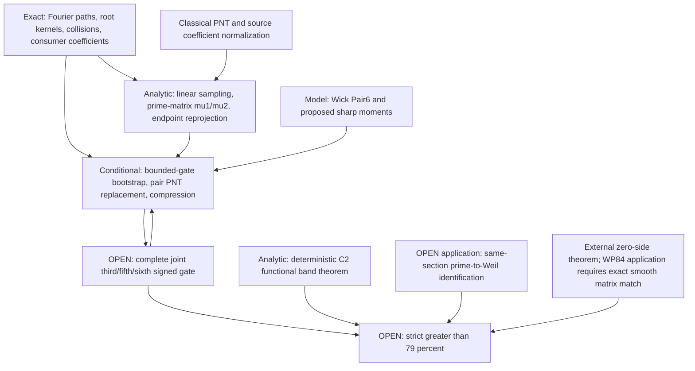

# WP84 frozen research frontier and publication decision

This report summarizes a research-frontier audit of the WP84 project. The
source repository was created on 2026-10-03; this separate public repository does
not carry over its commit history, branch names, or private audit files.
**Strict >79% is OPEN.**

The broader internal audit recorded 43 named replay suites and four
additional certificate checks passing on isolated copies. Those historical
checks are not all included here and do not independently reproduce from
this tree. They verify declared finite claims, not every inherited analytic
theorem. The present release candidate includes four selected verifier
programs and a new deterministic exact C5 shard runner. See the
[proof/novelty audit](WP84_PUBLICATION_READINESS_AUDIT.md) and
[reproducibility instructions](../REPRODUCIBILITY.md).

## Exact remaining target

Retain R=6000, X=T/(2pi), L=log X, N=floor(exp(L-sqrt L)), the same
section, original filters, all prime powers before the bounded-gate
reduction, exact root sums and alias carriers. Set

    c3=21981971/46375000, A=11501/12500, B=137641/250000,
    Jcap=51835308978310574561/457924342652122500000.

The sufficient frozen gate, with paid transfer errors kappa and strict
gap eta>0, is

    limsup_T [c3 mu3 - A mu5 + B mu6] <= Jcap-kappa-eta.

Equivalently, after the justified complete bounded-gate reductions, the
actual signed residual must be at most

    Jcap - B Pair6_6000 - kappa - eta,
    residual = Re[c3 D3** - A(D5*+Q3**) + B(D6*+Q4*)].

The stars mean exactly the surviving populations in the frozen high-product
and cubic-alias reports; they do not denote model replacements. Q3/Q4
retain the physical fifth/sixth paths and balanced-pair factors. The
necessary negative saving exceeds

    15909857470864664470267332031322977 /
    7733161315109907280429056000000000000
      =0.002057354918974498...,

plus kappa and a strict gap. Pair6's lower bound supplies a NECESSARY test,
not a sufficient replacement of the actual Pair6 in an upper bound.
The second-moment payment is 208480952/203775517378125 and the band payment
128952763/92407500000. The conditional reference margin is
8558084052085891/91584868530424500000=0.00009344430132847649... .
Reference moments 1/36 and 34/135 are bookkeeping/model values, not proved
actual prime or zeta moments; mu3=o(1) is not assumed.

## Dependency graph

The O/C two-way arrows express a PROVED bounded-gate equivalence, not an
independent proof of O. The model arrow carries only the identified paired
reference and conditional moment bookkeeping; proposed sharp moments do
not establish O. Arbitrary high-moment row deletion is not inferred from
o(d) deletion alone. Exact existential endpoint selection is sufficient for
its own reprojection theorem; missing historical determinant rows are an
auxiliary-route provenance gap, not a prerequisite for the signed gate.

## Ranked standalone candidates

1. **Curvature-controlled band truncation for discrete Loewner matrices.**
   Complete deterministic proof; possible modest specialized contribution.
2. **Filtered empirical fourth-cumulant sign counterexamples.** Complete
   algebra plus certified intervals; possible standalone corrective result.
3. **Alias-uniform quadratic prime correlation and same-section variance.**
   Complete source-matched proof; classical methods, specialized application.
4. **Simultaneous endpoint selection and fixed-band reprojection.** Complete
   proof under explicit cutoff/second-mass assumptions; classical techniques.
5. **Exact nine-site Gaussian Loewner sixth-moment lower certificate.**
   Independently verified computational result for a defined reference;
   not a theorem for the full arithmetic sixth moment.

Recommended preparation topic: **Curvature-controlled band truncation for
discrete Loewner matrices**, centered on candidate 1 with candidate 4 as an
application. The mathematics supports a standalone note. Originality,
venue suitability and submission readiness are not established; compare
the explicit specialization against existing perturbation theory first.

## STOP / REOPEN criterion

STOP the failed Type-II/completion, norm-only, rank and model-promotion
routes. A method obstruction is not a counterexample to the arithmetic
target. The sharpest sufficient reopening theorem is the aggregate
one-sided residual bound above, with the actual Pair6 and all remaining
windows/tails retained, a strictly positive gap, and source normalization
and transfer payments stated. It is weaker than proving separate model
limits or mu3=o(1).

A genuinely new source-weighted prime-product strip theorem may justify
limited proof work only if it has a quantified net improvement for the
actual source sum, with completion, path/root summation and logarithms paid.
At U~X^(8/5), V~X^(3/5), the existing loss is X^(1/10); an absolute
o(1) removal earns no negative constant by itself. It must leave an explicit
budget for the other populations. Neither a surrogate rectangle estimate,
a coefficient sign, nor an improved model certificate meets this criterion.
Prime-to-Weil and zero-side application obligations remain separate.

No new estimate, consumer optimization or theorem-search calculation was
performed in this audit. Historical claims are flagged in the companion
document; their source files are preserved.
